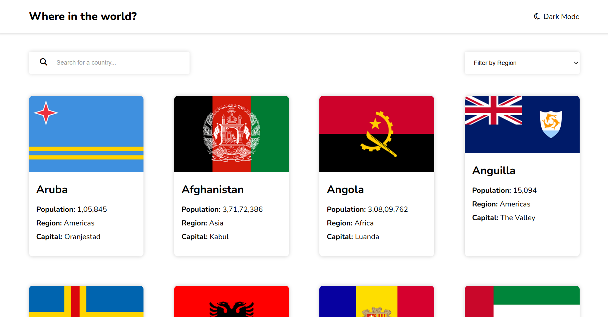
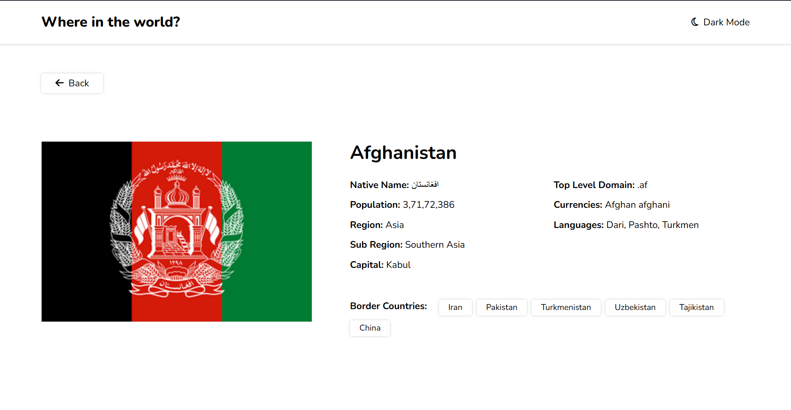

# 🌍 Countries Explorer

A responsive **Countries Explorer** built with **HTML, CSS, and JavaScript**. The app loads country information from public JSON datasets, lets users search and filter countries, and provides a detailed page for each country.


## 🔗 Live Demo

**Live Demo:** Netlify URL here after deployment.

Example:

`(https://countries-explorer-mohd.netlify.app/)`

## 📸 Screenshots

Add your screenshots to the `screenshots/` folder and use the following images in this section.

### Home Page



### Country Details



> **How to add screenshots:** Open the project in your browser, take screenshots of the home page and a country-details page, save them as `home.png` and `country-details.png`, and put them inside the `screenshots` folder.

## ✨ Features

- 🔎 Search countries by name
- 🌎 Filter countries by region
- 🏳️ Display country flags
- 👥 Display population, region, and capital
- 📄 View detailed information about a country
- 🗺️ View bordering countries
- 💰 View currencies
- 🗣️ View languages
- 🌐 View top-level domain
- 📱 Responsive layout
- 🌙 Dark-mode styling on the main page
- ⚡ Dynamic data loading with JavaScript `fetch()`

## 🛠️ Technologies Used

- **HTML5** – page structure
- **CSS3** – styling and responsive layout
- **JavaScript (ES6+)** – API/data fetching, search, filtering and dynamic rendering
- **REST Countries flag assets** – country flag images
- **Font Awesome** – icons
- **Google Fonts (Nunito)** – typography

## 📂 Project Structure

```text
countries-explorer/
│
├── index.html              # Country listing page
├── style.css               # Main page styling
├── script.js               # Search, filter and country-card logic
│
├── country.html            # Country details page
├── country.css             # Country details styling
├── country.js              # Country details and border-country logic
│
├── screenshots/
│   ├── home.png            # Add your home-page screenshot
│   └── country-details.png # Add your details-page screenshot
│
├── .gitignore
└── README.md
```

## 🚀 Run Locally

### Option 1: VS Code + Live Server

1. Download or clone this repository.
2. Open the project folder in **VS Code**.
3. Install the **Live Server** extension if you do not already have it.
4. Right-click `index.html`.
5. Select **Open with Live Server**.
6. The project will open in your browser.

### Option 2: Simple local server

If Python is installed, open a terminal in the project folder and run:

```bash
python -m http.server 5500
```

Then open:

```text
http://localhost:5500
```

## 📊 Data Sources

This project uses public JSON datasets hosted on GitHub:

- Country information: `mledoze/countries`
- Population data: `samayo/country-json`
- Flag images: REST Countries flag assets

The project was updated to avoid relying on the deprecated REST Countries v3 API endpoint that the original course project used.

## 🔄 How the App Works

1. `script.js` loads country and population data with `fetch()`.
2. The country data is combined with population information.
3. JavaScript dynamically creates country cards on the home page.
4. The search input filters countries by name.
5. The region dropdown filters countries by region.
6. Clicking a country opens `country.html` with the country name in the URL.
7. `country.js` reads the URL parameter and loads the selected country's details.
8. Border countries are converted into links to their own detail pages.

## 🌐 Deploy on GitHub Pages

GitHub Pages can publish static HTML, CSS, and JavaScript files directly from a repository. Make sure `index.html` is in the top level of the publishing folder.

### Steps

1. Create a new GitHub repository, for example:

```text
countries-explorer
```

2. Upload all files from this project to the repository.
3. Open the repository on GitHub.
4. Go to **Settings → Pages**.
5. Under **Build and deployment**, choose **Deploy from a branch**.
6. Select the `main` branch and the `/ (root)` folder.
7. Save the settings.
8. GitHub will provide your published site URL.

GitHub notes that publishing can take a few minutes after changes are pushed.

Official documentation: https://docs.github.com/en/pages/quickstart

## 🚀 Deploy on Netlify

### Method 1: Deploy from GitHub (recommended for future updates)

1. Push this project to GitHub.
2. Log in to Netlify.
3. Choose **Add new project → Import an existing project**.
4. Connect your GitHub account.
5. Select the `countries-explorer` repository.
6. For this plain HTML/CSS/JS project, the repository root contains the files to publish.
7. Deploy the site.

After connecting the repository, future pushes can trigger new deployments automatically.

### Method 2: Drag and drop

1. Open Netlify's deploy page.
2. Unzip this project if necessary.
3. Drag the project folder containing `index.html`, CSS, and JavaScript files into the Netlify drop area.
4. Netlify will publish the site and provide a `netlify.app` URL.

Official documentation: https://docs.netlify.com/start/quickstarts/netlify-drop-quickstart/

## 🧪 Troubleshooting

### Countries are not loading

- Check that you have an active internet connection.
- Open the browser developer tools with `F12` and check the **Console** tab.
- Refresh the page.

### Country details page is blank

Make sure you opened the project through a local server such as Live Server instead of relying on a `file://` URL.

### Flags are not displaying

Flag images are loaded from an external service, so an internet connection is required.

### GitHub Pages shows a blank page

Make sure `index.html` is at the repository root (or at the root of the selected Pages publishing folder).

## 🔮 Future Improvements

- Add a persistent dark-mode preference with Local Storage
- Add a loading indicator
- Add improved error and empty-search states
- Add sorting by population/name
- Improve accessibility and keyboard navigation
- Add animations for country cards
- Add a map view for countries

## 👨‍💻 Author

**Mohd Anas**

Frontend Developer | JavaScript | DSA with Java

---

If you like the project, consider giving the repository a ⭐ on GitHub.
